# AWS FRED Economic Data Lake

A serverless AWS data pipeline that ingests 30 economic data series from the FRED API, transforms the data into an analytics-ready data lake, and makes it queryable with Athena.

## Architecture

```
EventBridge (Daily Schedule)
          │
          ▼
    Step Functions
          │
          ▼
    Lambda (Ingestion)
          │
          ▼
        S3 (Raw)
raw/ingestion_date=YYYY-MM-DD/
          │
          ▼
    Glue ETL (PySpark)
      • Transform
      • Data Validation
      • Write Parquet
          │
          ▼
    S3 (Processed)
processed/economic_indicators/
          │
          ▼
Glue Crawler (Asynchronous)
          │
          ▼
  Glue Data Catalog
          │
          ▼
        Athena


Failures (Lambda/Glue ETL/Start Crawler)
                │
                ▼
    Step Functions Catch Handler
                │
                ▼
            SNS Email
```

## EventBridge Daily Schedule

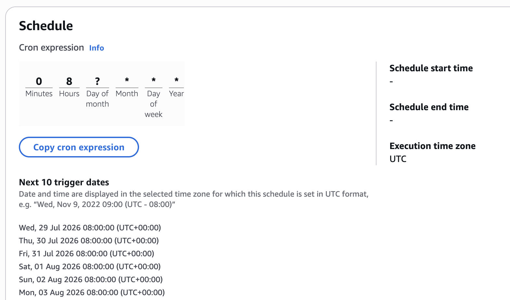

## Step Functions Orchestration

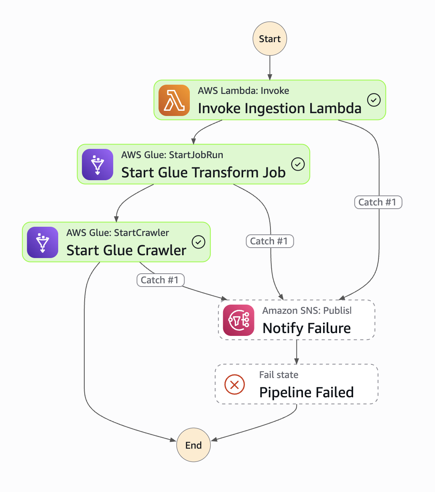

## Lambda Execution

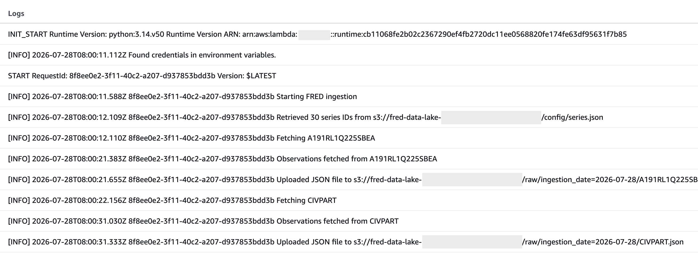
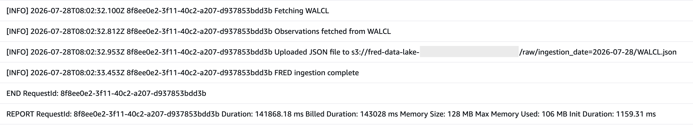

## S3 Raw Data Lake

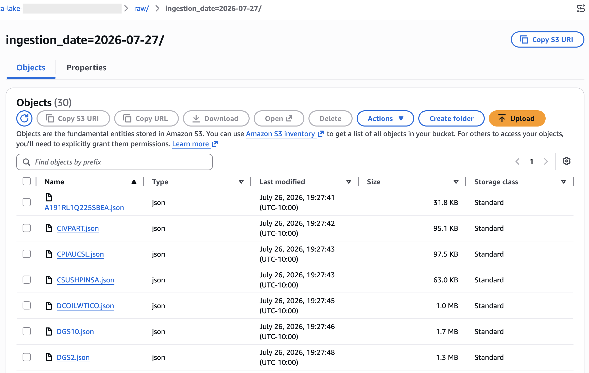

## Glue ETL Job Run

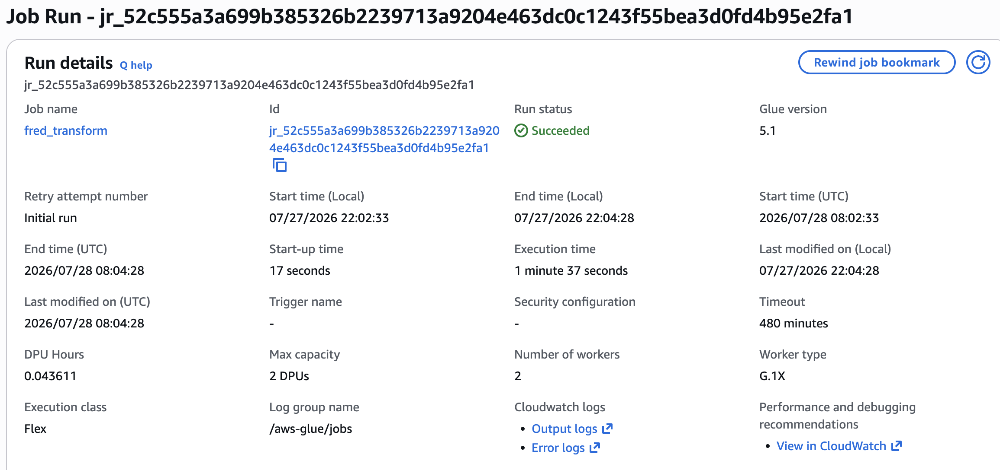

## S3 Processed Data Lake

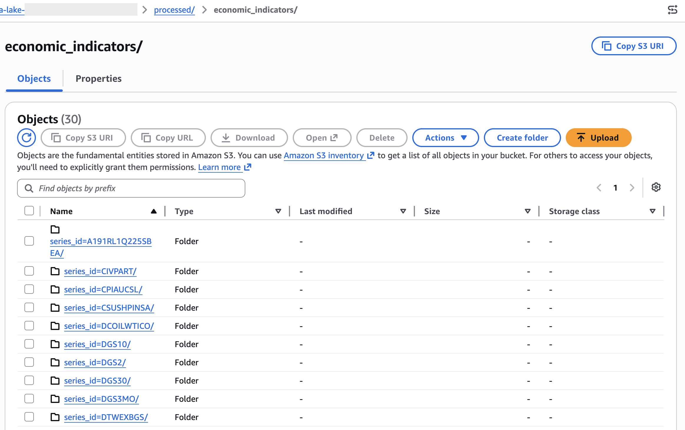
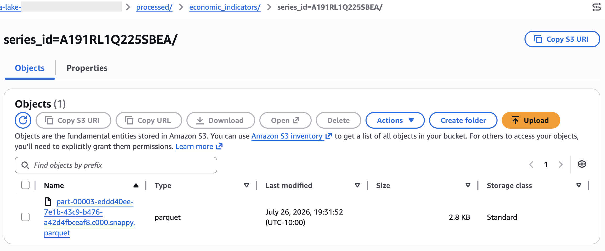

## Glue Data Catalog Table

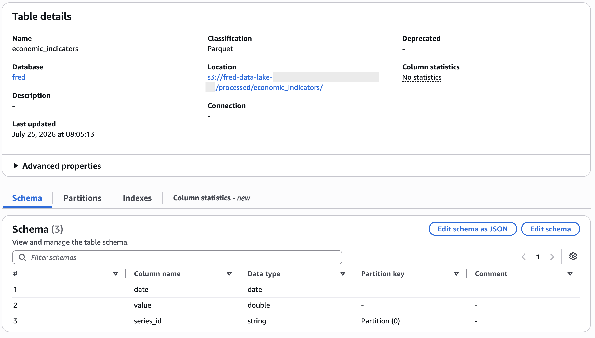

## Athena Query

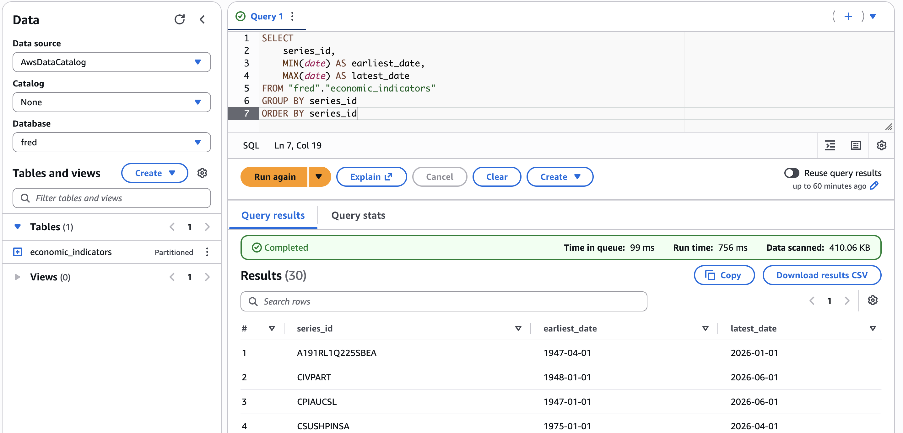

## SNS Failure Email

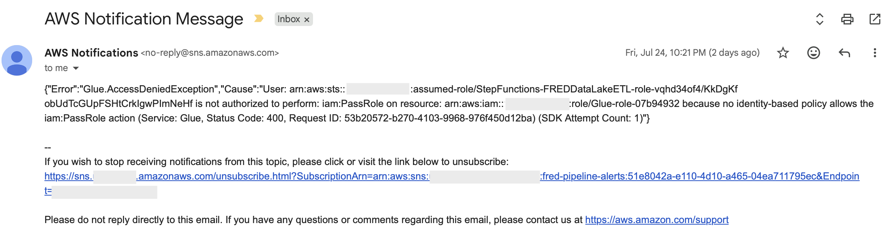